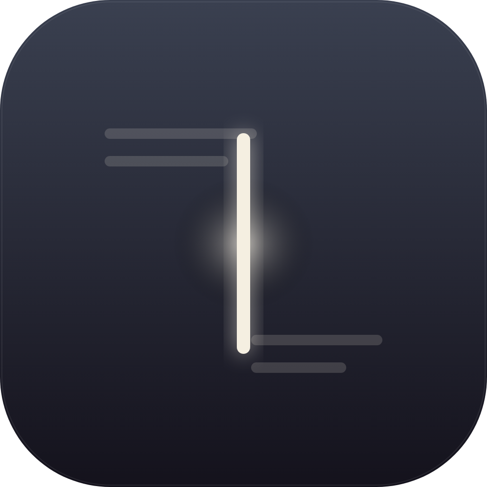

<div align="center">



# 隐墨 Inkveil

**本地优先的无缝 Markdown 编辑器 · Typora 风格 · 安装包仅 6.5MB**

写作时看不见 Markdown,光标离开,语法自动隐去;光标回来,记号重新显现。
所写即所得,却不丢一个原始字符。

-000?style=flat-square)


</div>

---

## 这是什么

隐墨是一款桌面 Markdown 编辑器,核心理念只有一句:**写作时不该看见语法**。

传统 Markdown 编辑器要么左右分屏(写一半看一半),要么所见即所得(丢失源码控制)。隐墨走第三条路——**无缝隐现**:`# 标题`、`**加粗**`、`[链接]()` 这些标记,只在光标所在的那一行显形,光标一离开立即渲染为成品排版。你始终在看最终效果,但任何一处都能瞬间回到源码精确编辑。零损失往返,源码与渲染本就是同一份文本。

图标中央那道发光的光标、向两侧渐隐的文字,就是这个理念的具象。

## 核心特性

### ✍️ 无缝隐现编辑
- 语法标记按光标位置**自动隐现**,正文即所见
- **零损失往返**:渲染态 ↔ 源码态切换不丢任何字符
- **中文输入法安全**:输入过程不丢字、不串行、不打断候选
- 键盘移动**原子化**:方向键跨越隐藏标记时光标行为符合直觉
- 随时一键切换**整篇源码模式**

### 📝 沉浸写作
- **专注模式**——非当前段落淡出,只剩眼前这句
- **打字机模式**——当前行恒定居中,视线不动
- **大纲面板**——标题树导航,长文不迷路
- **实时字数统计**——字符 / 单词 / 阅读时长

### 🧮 富内容
- **KaTeX** 数学公式(行内与块级)
- **Mermaid** 图表(流程图、时序图、甘特图、架构图等全套)
- **表格可视化编辑**——不用手敲 `|`,像 Excel 一样改
- **图片粘贴**——截图直接 Ctrl/Cmd+V,自动落盘到 `assets/` 并插入相对路径

### 💻 真桌面应用
- 原生**文件树**,打开 / 保存 / 新建
- 原生**菜单与快捷键**,符合 macOS 习惯
- **系统级打开**——Finder 双击 `.md` 直接用隐墨打开
- **外部改动监听**——文件被其他程序改动时提示重载

### 🔄 导入导出
- 打开 Word **`.docx`**——有损转为 Markdown 子集,作为草稿载入,**绝不回写原文件**
- 导出**独立 HTML**(样式内联,单文件可分发)
- 导出 **PDF**
- 可选 **Pandoc** 通道,接入更多格式

### 🛟 不丢稿
- **会话热退出**——关闭无需确认,内容自动缓存
- **启动恢复**——重开即回到上次的文件与光标位置

### 🎨 顺手细节
- **暗色模式**
- 正文**列宽随窗口自适应**,宽屏不至于一行拉到天边

## 为什么只有 6.5MB

| | Electron 版 | **隐墨 (Tauri)** |
|---|---|---|
| 安装包 | 94 MB | **6.5 MB** |
| 安装后体积 | 232 MB | 14 MB |
| 渲染内核 | 自带 Chromium | 复用系统 WebView |
| 启动速度 | 慢 | 快 |

隐墨基于 **Tauri** 构建,不打包浏览器内核,直接复用 macOS 系统 WebView。更小、更快、纯本地——**不联网、不上传、不追踪**,你的文字只在你的硬盘上。

## 安装(macOS)

> 当前为 Apple Silicon(arm64)构建。

1. 下载 DMG,打开,把 **隐墨** 拖进 `Applications`。
2. 安装包未做 Apple 代码签名,首次打开会被 Gatekeeper 拦截(提示"已损坏"或"无法验证开发者")。在终端执行**一次**以下命令去除隔离属性:

   ```bash
   xattr -dr com.apple.quarantine /Applications/Inkveil.app
   ```

3. 之后正常双击打开,无需再处理。

> **说明**:隔离属性是浏览器 / AirDrop 在下载时打上的标记,与应用本身无关,与"病毒"无关。命令执行一次永久生效。彻底免提示需 Apple 开发者签名 + 公证。

## 从源码构建

```bash
# 依赖:Node.js、Rust 工具链
npm install
npm run tauri:build
```

产物位于 `src-tauri/target/release/bundle/`:

- `dmg/Inkveil_<version>_aarch64.dmg` —— DMG 安装包
- `macos/Inkveil.app` —— 免安装应用

开发模式:

```bash
npm run tauri:dev      # Tauri 桌面开发
npm run dev            # 纯前端(浏览器)开发
npm run typecheck      # 类型检查
npm test               # 单元测试
```

## 技术栈

- **Tauri** —— 桌面外壳(Rust),系统 WebView
- **CodeMirror 6** —— 编辑器内核,无缝隐现的实现基础
- **markdown-it** —— Markdown 解析与渲染
- **KaTeX** / **Mermaid** —— 公式与图表
- **Vite** + **TypeScript** —— 前端构建

---

<div align="center">

**隐墨 Inkveil**

作者:彭大大 · 版本 2026.05 · macOS (Apple Silicon)

*所写即所得,不丢一字。*

</div>
